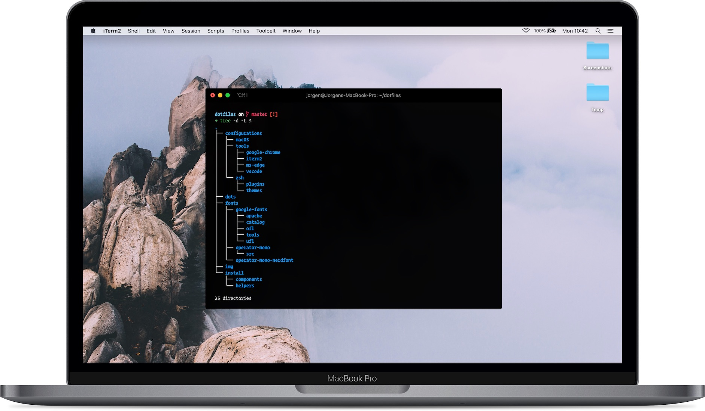

<h1 align="center">dotfiles</h1>
<h4 align="center">💻 Automated configuration, preferences and software installer for macOS</h4>
<p align="center">This dotfiles setup has been created for personal use on clean systems.<br>Usage on existing systems has not been tested. Support for existing systems is work in progress.</p>

<p align="center">
   </p>

## Installation

Open terminal, paste the code and kaboom!

```bash
git clone --recurse-submodules https://github.com/jorgenkrieger/dotfiles ~/dotfiles;
 ~/dotfiles/install/install.sh
```

## Software Installation
Most required apps (cli & gui) are installed via Homebrew (using casks & [mas](https://github.com/mas-cli/mas))

<details>
<summary><b>CLI</b></summary>

- [mas](https://github.com/mas-cli/mas) - Mac App Store extension for Homebrew
- [git](https://git-scm.com/) - Latest Git version
- [zsh](https://www.zsh.org/) - Latest ZSH version
- [bat](https://github.com/sharkdp/bat) - Improved version of cat
- [tree](https://formulae.brew.sh/formula/tree#default) - Tree view of directories
- [wget](https://www.gnu.org/software/wget/) - Alternative to curl
- [dockutil](https://github.com/kcrawford/dockutil) - macOS Dock Utility
- [node](https://nodejs.org/en/) - NodeJS
- [python](https://www.python.org/) - Python version 3
</details>

<details>
<summary><b>Development</b></summary>

- [Visual Studio Code](https://github.com/microsoft/vscode) - Main editor
- [iTerm2](https://iterm2.com/) - Terminal
- [Docker](https://www.docker.com/) - Development environment
- [Sequel Pro](https://sequelpro.com/) - Database manager
- [Transmit](https://www.panic.com/transmit/) - FTP, SFTP, S3 and more
- [Postman](https://www.getpostman.com/) - API Exploration 
- [Draw.io](https://www.draw.io) - Drawing schematics
- [Dash](https://kapeli.com/dash) - Offline code docs
- [Hammerspoon](https://www.hammerspoon.org/) - macOS programming via Lua
- [Arduino](https://www.arduino.cc/) - Arduino SDK
</details>


<details>
<summary><b>Design</b></summary>

- [Sketch](https://www.sketch.com/) - Main web design tool
- [Craft Manager](https://www.invisionapp.com/craft) - Plugin for Sketch
- [Adobe Creative Cloud](https://www.adobe.com/creativecloud.html) - Photoshop, Illustrator, InDesign, After Effects, Premiere, Lightroom
- [ImageOptim](https://imageoptim.com/mac) - Image filesize compression
</details>

<details>
<summary><b>Browsers</b></summary>

- [Microsoft Edge (developer channel)](https://www.microsoftedgeinsider.com/en-us/) - Daily driver
- [Firefox Developer Edition](https://www.mozilla.org/en-US/firefox/developer/) - Development focused browser
- [Google Chrome](https://www.google.nl/chrome/) - Backup
</details>

<details>
<summary><b>Communication</b></summary>

- [Spark](https://sparkmailapp.com/) - Email & calendar
- [Slack](https://slack.com/) - Team communication
- [Skype](https://www.skype.com/) - (Video)calling
- [WhatsApp](https://www.whatsapp.com/) - Instant messaging
- [LINE](https://line.me/en/) - Instant messaging
- [KakaoTalk](https://www.kakaocorp.com/service/KakaoTalk?lang=en) - Instant messsaging
</details>

<details>
<summary><b>Project Management & Productivity</b></summary>

- [1Password](https://1password.com/) - Password manager
- [Alfred](https://www.alfredapp.com/) - Improved mac spotlight
- [Amphetamine](https://apps.apple.com/us/app/amphetamine/id937984704?mt=12) - Prevent standby
- [Bartender](https://www.macbartender.com/) - Icon cleaner
- [Endel](https://endel.io/) - Audio soundscapes
- [Harvest](https://www.getharvest.com/) - Time tracking
- [Notion](https://www.notion.so/) - To-do lists, internal wiki
</details>

<details>
<summary><b>Miscellaneous</b></summary>

- Keynote
- Pages
- Numbers
</details>

## Settings
This project changes many settings in macOS and tools.

<details>
<summary><b>General UI/UX</b></summary>

- Disable the sound effects on boot
- Increase window resize speed for Cocoa apps
- Expand save panel by default
- Expand print panel by default
- Save to disk (not to iCloud) by default
- Automatically quit printer app once the print jobs complete
- Disable the "Are you sure you want to open this application?" dialog
- Remove duplicates in the "Open With" menu
- Disable automatic termination of inactive apps
- Restart automatically if the computer freezes
- Disable smart dashes as they're annoying when typing codes
- Disable smart quote replacement
- Disable auto-correct

<sup>View [source code](https://github.com/JorgenKrieger/dotfiles/blob/master/configurations/macOS/defaults.sh#L10)</sup>
</details>

<details>
<summary><b>Devices</b></summary>

- Trackpad
  - Enable tap to click for this user and login screen
  - Map bottom right corner to rightclick
- Keyboard
  - Set a blazingly fast keyboard repeat rate
  - Set language and text formats
- Audio
  - Increase sound quality for Bluetooth headphones
- Set timezone

<sup>View [source code](https://github.com/JorgenKrieger/dotfiles/blob/master/configurations/macOS/defaults.sh#L59)</sup>
</details>

<details>
<summary><b>Screen</b></summary>

- Require password immediately after sleep
- Save screenshots to the desktop
- Save screenshots in PNG format
- Enable subpixel font rendering on non-Apple LCDs

<sup>View [source code](https://github.com/JorgenKrieger/dotfiles/blob/master/configurations/macOS/defaults.sh#L100)</sup>
</details>

<details>
<summary><b>Finder</b></summary>

- Finder: allowing quitting via ⌘ + Q; doing so will also hide desktop icons 
- Finder: disable window animations and Get Info Animations
- Set desktop as the default location for new Finder windows
- Show icons for hard drives, servers and removable drives
- Finder: show all filename extensions
- Finder: show status bar
- Finder: show path bar
- Display full POSIX path as Finder window title
- Keep folders on top when sorting by name
- When performing a search, search the current folder by default
- Disable the warning when changing a file extension
- Enable spring loading for directories
- Remove spring loading delay for directories
- Avoid creating .DS_Store files on network or USB
- Automatically open a new Finder window when a volume is mounted
- Use list view in all Finder windows by default
- Show the ~/Library folder
- Show the /Volumes folder
- Expand the File Info panes

<sup>View [source code](https://github.com/JorgenKrieger/dotfiles/blob/master/configurations/macOS/defaults.sh#L124)</sup>
</details>

<details>
  <summary><b>Dock, Dashboard and hot corners</b></summary>

  - Show indicator lights for open applications in the Dock
  - Don't animate opening applications from the Dock
  - Speed up Mission Control animations
  - Don't group windows by application in Mission Control
  - Disable Dashboard
  - Don't show Dashboard as a space
  - Don't automatically rearrange Spaces based on most recent use
  - Remove the auto-hiding Dock delay
  - Remove the animation when hiding/showing the Dock

  <sup>View [source code](https://github.com/JorgenKrieger/dotfiles/blob/master/configurations/macOS/defaults.sh#L202)</sup>
</details>

<details>
<summary><b>Safari</b></summary>

- Privacy: don't send search queries to Apple
- Press Tab to highlight each item on a web page
- Show the full URL in the address bar (note: this still hides the scheme)
- Prevent Safari from opening 'safe' files automatically after downloading
- Allowing hitting the Backspace key to go to the previous page in history
- Hide Safari's bookmarks bar by default
- Hide Safari's sidebar in Top Sites
- Enable Safari's debug menu
- Make Safari's search banners default to Contains instead of Starts With
- Enable the Develop menu and the Web Inspector in Safari
- Add a context menu item for showing the Web Inspector in web views
- Enable continuous spellchecking
- Disable auto-correct
- Disable AutoFill
- Warn about fraudulent websites
- Disable Java
- Block pop-up windows
- Enable "Do Not Track"
- Update extensions automatically

<sup>View [source code](https://github.com/JorgenKrieger/dotfiles/blob/master/configurations/macOS/defaults.sh#L240)</sup>
</details>

<details>
  <summary><b>Activity Monitor</b></summary>

  - Show the main window when launching Activity Monitor
  - Visualize CPU usage in the Activity Monitor Dock icon
  - Show all processes in Activity Monitor
  - Sort Activity Monitor results by CPU usage

  <sup>View [source code](https://github.com/JorgenKrieger/dotfiles/blob/master/configurations/macOS/defaults.sh#L313)</sup>
</details>

<details>
  <summary><b>macOS Standard apps</b></summary>

  - Enable the debug menu in Address Book
  - Enable Dashboard dev mode - allow keeping widgets on the desktop
  - Use plain text mode for the new TextEdit documents
  - Open and save files as UTF-8 in TextEdit
  - Enable the debug menu in Disk Utility

  <sup>View [source code](https://github.com/JorgenKrieger/dotfiles/blob/master/configurations/macOS/defaults.sh#L334)</sup>
</details>

<details>
  <summary><b>App Store</b></summary>

  - Enable the automatic update check
  - Check for software updates daily, not just once per week
  - Download newly available updates in background
  - Install System data files & security updates
  - Turn on app auto-update

  <sup>View [source code](https://github.com/JorgenKrieger/dotfiles/blob/master/configurations/macOS/defaults.sh#L356)</sup>
</details>

<details>
  <summary><b>Google Chrome</b></summary>

  - Disable the all too sensitive backswipe on trackpads
  - Disable the all too sensitive backswipe on Magic Mouse
  - Use the system-native print preview dialog
  - Expand the print dialog by default

  <sup>View [source code](https://github.com/JorgenKrieger/dotfiles/blob/master/configurations/macOS/defaults.sh#L379)</sup>
</details>

<details>
  <summary><b>Visual Studio Code</b></summary>

  - Disable Apple press and hold for VS Code

  <sup>View [source code](https://github.com/JorgenKrieger/dotfiles/blob/master/configurations/macOS/defaults.sh#L403)</sup>
</details>

## Personal Preferences

<details>
  <summary><b>macOS</b></summary>

  - Desktop
    - [Default screenshot location](https://github.com/JorgenKrieger/dotfiles/blob/master/install/components/desktop.sh#L29)
    - [Temporary folder](https://github.com/JorgenKrieger/dotfiles/blob/master/install/components/desktop.sh#L9)
    - [Background](https://github.com/JorgenKrieger/dotfiles/blob/master/img/wallpaper.jpg) - by [Alexandre Chambon](https://unsplash.com/@goodspleen)
  - [Dock icons](https://github.com/JorgenKrieger/dotfiles/blob/master/configurations/macOS/dock.sh)
  - DNS selection 
    - [CloudFlare](https://1.1.1.1/dns/)
    - [Google DNS](https://developers.google.com/speed/public-dns/)
    - [Open DNS](https://use.opendns.com/))
  - Hosts file
    - [someonewhocares.org](https://someonewhocares.org/hosts/)
</details>

<details>
  <summary><b>ZSH</b></summary>

  - [Aliases](https://github.com/JorgenKrieger/dotfiles/blob/master/dots/.aliases)
  - Theme: [Spaceship prompt](https://github.com/denysdovhan/spaceship-prompt)
  - Plugin: [ZSH Syntax Highlighting](https://github.com/zsh-users/zsh-syntax-highlighting)
</details>

<details>
  <summary><b>Hammerspoon</b></summary>

  - Window Management
    - Fixed resolutions (1920x1080, 1440x900, 1336x768)
    - Full screen
    - Center screen
    - Left/Right (1/2, 1/3, 2/3)
    - Top/Bottom (1/2, 1/3, 2/3)
    - Monitor change (North, East, South, West)
  - Application Launcher
</details>

<details>
  <summary><b>Visual Studio Code</b></summary>
  <b>Settings</b>

  - Editor<br>
    <sup>Font, line height, cursor, tabs, suggestions</sup>
  - Explorer<br>
    <sup>Icons, exclude list, indentation</sup>
  - Terminal<br>
    <sup>Font, shell</sup>
  - Extensions
    - Colorize
    - ESLint
    - Indent Rainbow
    - Bracket Pair Colorizer
    - Vim
    - Auto Close Tag

  <b>Plugins</b>

  Languages
  - [Ruby](https://marketplace.visualstudio.com/items?itemName=rebornix.Ruby)
  - [Sass](https://marketplace.visualstudio.com/items?itemName=syler.sass-indented)
  - [Slim](https://marketplace.visualstudio.com/items?itemName=sianglim.slim)
  - [Vim](https://marketplace.visualstudio.com/items?itemName=dunstontc.viml)
  - [Python](https://marketplace.visualstudio.com/items?itemName=ms-python.python)

  Linters
  - [Coffeelinter](https://marketplace.visualstudio.com/items?itemName=lkytal.coffeelinter)
  - [ESLinter](https://marketplace.visualstudio.com/items?itemName=dbaeumer.vscode-eslint)
  - [Sass Linter](https://marketplace.visualstudio.com/items?itemName=glen-84.sass-lint)
  - [Slim Linter](https://marketplace.visualstudio.com/items?itemName=aliariff.slim-lint)
  - [Stylelint](https://marketplace.visualstudio.com/items?itemName=thibaudcolas.stylelint)

  Intellisense
  - [Path Intellisense](https://marketplace.visualstudio.com/items?itemName=christian-kohler.path-intellisense)
  - [PHP Intellisense](https://marketplace.visualstudio.com/items?itemName=felixfbecker.php-intellisense)
  - [SCSS Intellisense](https://marketplace.visualstudio.com/items?itemName=mrmlnc.vscode-scss)
  - [SCSS Everywhere](https://marketplace.visualstudio.com/items?itemName=gencer.html-slim-scss-css-class-completion)

  Themes & colors
  - [Monokai Pro](https://marketplace.visualstudio.com/items?itemName=monokai.theme-monokai-pro-vscode)
  - [File Icons](https://marketplace.visualstudio.com/items?itemName=file-icons.file-icons) & [Material icon theme](https://marketplace.visualstudio.com/items?itemName=pkief.material-icon-theme)
  - [Bracket pari colorizer 2](https://marketplace.visualstudio.com/items?itemName=coenraads.bracket-pair-colorizer-2)
  - [Better comments](https://marketplace.visualstudio.com/items?itemName=aaron-bond.better-comments)
  - [Indent rainbow](https://marketplace.visualstudio.com/items?itemName=oderwat.indent-rainbow)
  - [Colorize](https://marketplace.visualstudio.com/items?itemName=kamikillerto.vscode-colorize)

  Code automatisation
  - [Auto Rename Tag](https://marketplace.visualstudio.com/items?itemName=formulahendry.auto-rename-tag)
  - [Auto Close Tag](https://marketplace.visualstudio.com/items?itemName=formulahendry.auto-close-tag)
  - [TabNine](https://marketplace.visualstudio.com/items?itemName=TabNine.tabnine-vscode) 

  Misc
  - [Alignment](https://marketplace.visualstudio.com/items?itemName=annsk.alignment)
  - [Docker](https://marketplace.visualstudio.com/items?itemName=ms-azuretools.vscode-docker)
  - [Vim](https://marketplace.visualstudio.com/items?itemName=vscodevim.vim)
</details>


## References 🖤

This setup and configuration has been inspired by a lot of awesome developers and their dotfiles.

- [Tom de Bruijn](https://github.com/tombruijn/dotfiles)
- [Martijn Bleeker](https://github.com/martijnbleeker/dotfiles)
- [Adam Eivy](https://github.com/atomantic/dotfiles)

<sup>And others over at [Github does dotfiles](https://dotfiles.github.io/)</sup>

---
<p align="center"><sup>Made with 🧡 in The Netherlands</sup></p>