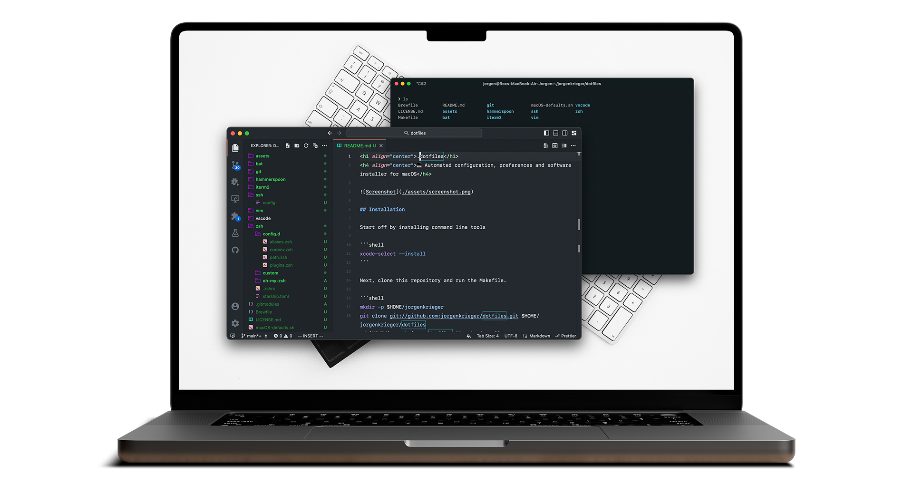

<h1 align="center">dotfiles</h1>
<h4 align="center">💻 Automated configuration, preferences and software installer for macOS</h4>
<p align="center">This dotfiles setup has been created for personal use on clean systems. Usage on existing systems has not been tested. Support for existing systems is work in progress.</p>

<div align="center">
	
</div>

## Installation

Start off by installing command line tools

```shell
xcode-select --install
```

Next, clone this repository and run the Makefile.

```shell
mkdir -p $HOME/jorgenkrieger
git clone git://github.com:jorgenkrieger/dotfiles.git $HOME/jorgenkrieger/dotfiles
cd $HOME/jorgenkrieger/dotfiles && make install
```

## Essential knowledge
> **Warning**
> Although dotfiles contain most preferences, not all preferences are equally shareble (think security settings). That's why the dotfiles repository should only contain shareble data and be symlinked into the system.

## Commands

These dotfiles use [GNU make](https://www.gnu.org/software/make/) to install the entire setup, or portions of it. This should be installed on the system by default.

| Command | Description |
| --- | --- |
| `make install` | Total dotfiles setup |
| `make help` | See available commands |
| `make dns` | Set DNS provider |
| `make folders` | Create default folder structure |
| `make hosts` | Install [Ultimate Hosts Blacklist](https://github.com/ultimate-hosts-blacklist/ultimate.hosts.blacklist) |
| `make mac-defaults` | Setup mac defaults settings |
| `make setup-bat` | Configure [bat](https://github.com/sharkdp/bat) settings |
| `make setup-git` | Configure default git profile |
| `make setup-hammerspoon` | Configure [hammerspoon](http://www.hammerspoon.org/) setup |
| `make setup-ssh` | Configure SSH to use 1Password |
| `make setup-vim` | Configure vim setup |
| `make setup-zsh` | Configure ZSH shell |

> **Note**
> After running the install command, you can use the `dotfiles` command to access the Makefile quickly.